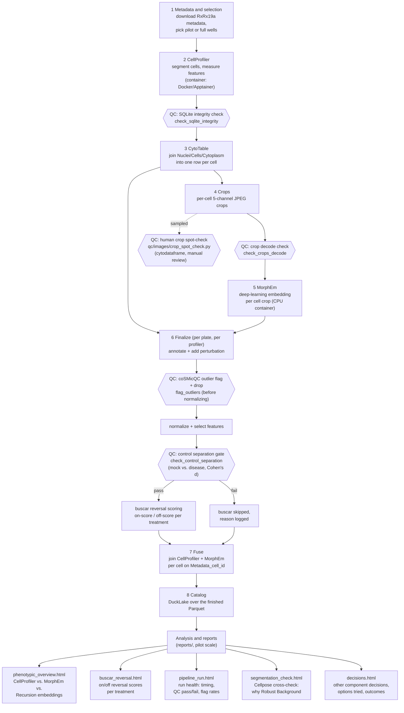
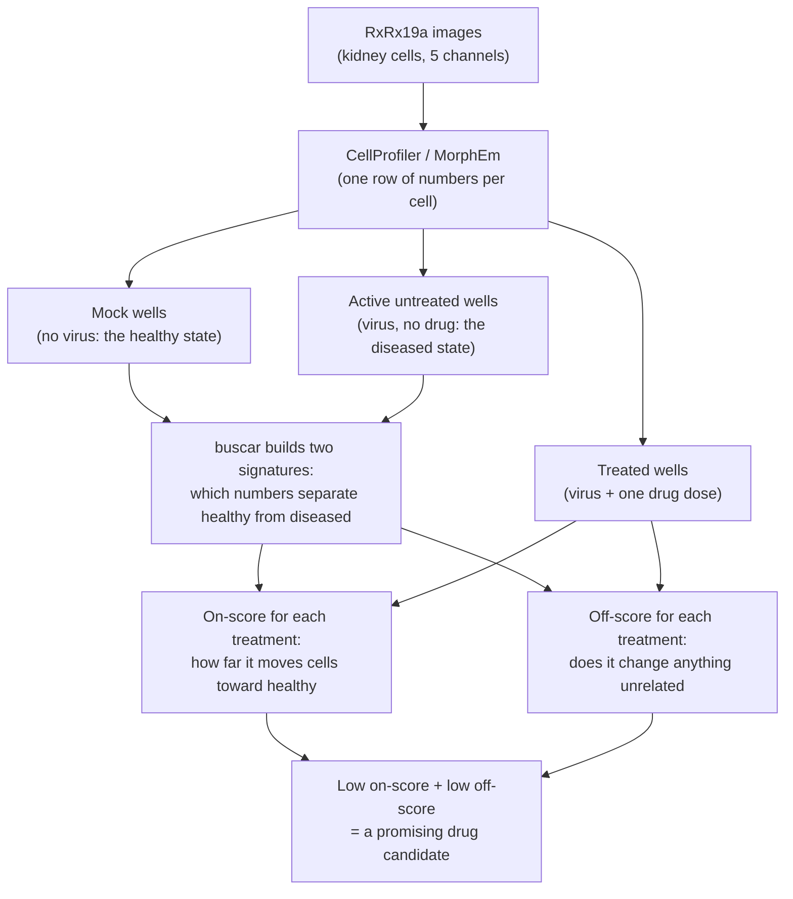

# RxRx19a reanalysis

This repository reanalyzes RxRx19a images to ask whether treatments move
SARS-CoV-2-infected cells toward a healthy appearance.
The pipeline is specific to RxRx19a, though some parts can be reused with
other datasets.

## What this pipeline does

The pipeline turns RxRx19a microscopy images into single-cell morphology
profiles.
It then uses buscar to score how much each treatment moves infected cells
toward the healthy state.

The pipeline has eight stages, in order:

1. **Metadata and selection** — download the RxRx19a metadata, then pick
   the wells for a run (a small pilot subset, or the full dataset).
1. **CellProfiler** — segment cells and measure per-cell features from
   the five-channel images. Runs in a container (Docker locally,
   Apptainer on Alpine).
1. **CytoTable** — join CellProfiler's per-compartment SQLite tables
   (Nuclei, Cells, Cytoplasm) into one row per cell, and add a stable
   `Metadata_cell_id`.
1. **Crops** — cut a JPEG crop of each cell from each of the five
   channels, for visual QC and embedding models.
1. **MorphEm** — run the MorphEm vision transformer over each cell's
   five-channel crop to get a 1,920-number deep-learning feature
   vector per cell (5 channels × 384 embedding dims). Runs in its own
   Apptainer container, on CPU.
1. **Finalize (per plate, per profiler)** — annotate, normalize, and
   select features with Pycytominer for both CellProfiler and MorphEm
   profiles, run a biological QC gate, and run buscar reversal
   scoring. See "Why the pipeline batches by plate" below.
1. **Fuse** — join the two feature sets per cell on `Metadata_cell_id`
   into one combined profile (`rerx.fuse`), written under
   `profiles/fused/` with a `fusion.json` sidecar.
1. **Catalog** — build a read-only DuckLake catalog over the finished
   Parquet files, so anyone can query the run with plain SQL.

Finalize also writes a human crop spot-check notebook
(`qc/images/crop_spot_check.py`, built by `rerx.qc_notebook` — a small,
seeded-random sample of per-cell crops rendered with
[`cytodataframe`](https://github.com/cytomining/CytoDataFrame) so a person
can open it in Jupyter and visually confirm segmentation looks centered
and masked correctly). It is a convenience output of every run, not a
pipeline stage with its own data to pass downstream.

The diagram below shows the same eight stages as data flowing left to
right, with the QC checks placed where they actually run, and the
pilot analysis reports that read the finished catalog at the end:



Two runners drive this pipeline:

- Local, small runs: `tests/test_pilot_e2e.py` (an opt-in end-to-end
  test) shows the full call sequence against a real CellProfiler
  container.
- Alpine HPC, full-scale runs: `workflows/main.nf` (Nextflow, Slurm
  executor) calls `scripts/rerx_tasks.py`, a thin command-line driver
  that wraps the same library functions under `src/rerx/`.

## Why the pipeline batches by plate

Each plate is its own biological batch: it has its own mock (healthy) and
disease (active, untreated) control wells, and normalization must
compare cells against controls from the *same* plate, not a different
one.

This has three effects on the code:

- `rerx.cytotable.plate_partitions` groups cell profiles by
  `(experiment, plate)`. Every downstream step consumes one plate's
  group at a time.
- `rerx.finalize.finalize_plate` runs annotate, normalize,
  feature-select, the control-separation QC gate, and buscar for one
  plate. It never holds more than one plate's cells in memory.
- A full multi-plate run (thousands of plates) processes plate by
  plate. Memory use stays flat as the run scales, instead of growing
  with the whole dataset.

If a future project has a different batching unit (for example, per
96-well plate barcode, or per acquisition day), replace
`plate_partitions`'s group key. The rest of `finalize_plate` does not
change.

## The biological QC gate

A technically clean run (every SQLite integrity check passes, every
crop decodes) can still carry bad biology — a failed stain, or a dead
plate where nothing grew. `rerx.validate.check_control_separation`
catches this case.

The check compares the mock and disease control populations on every
morphology feature, using Cohen's d effect size. If the median absolute
effect size falls below a threshold (0.5 by default), the check fails
for that plate.

This check runs before buscar, not after, for a concrete reason: buscar
itself raises an error when there is no separating feature between mock
and disease (division by zero inside its Earth Mover's Distance
calculation). `finalize_plate` checks first, then skips buscar with a
clear reason logged, instead of letting the whole run crash on one bad
plate.

## buscar reversal scoring

buscar (`rerx.buscar`) answers two questions per treatment:

1. How far does this treatment move a diseased cell back toward the
   healthy state? (the on-score)
1. Does the treatment touch anything else? (the off-score, which
   flags off-target effects)



buscar compares each drug-treated well against two reference states:
the healthy state (mock) and the diseased state (active untreated
infection). It does not compare drugs to each other directly.

A treatment is useful only if diseased cells start to look healthy
again. The on-score checks that. A treatment can also change cell
shape or behavior in ways that have nothing to do with the virus.
The off-score checks that.

A good drug candidate has a low on-score (cells move close to
healthy) and a low off-score (the drug does not disturb anything
else).

The scoring needs three pieces of metadata, all added automatically
during the finalize stage:

- `Metadata_rxrx_control_type` — RxRx19a's own control label (`mock`,
  `uv`, `active_untreated`, `treated`).
- `Metadata_perturbation` — a stable identifier for buscar to group
  replicate wells by. Mock, UV, and active-untreated controls each get
  their own value (so their differences stay visible). A dosed
  treatment becomes `<treatment>__<concentration>`, for example
  `Remdesivir (GS-5734)__1.0`.
- `Metadata_buscar_state` — `Mock` for mock wells, `Active SARS-CoV-2`
  for every challenged well (UV, active-untreated, treated).

buscar needs two control populations:

- **Target (healthy):** `mock` — uninfected cells. The on-score is the
  distance from this population. 0 means fully rescued to healthy, 1
  means still diseased.
- **Reference (disease):** `active_untreated` — infected cells with no
  drug.

Remdesivir is our known-active drug control. UV-inactivated virus is
our challenge control that should look healthy.

A note on naming: RxRx19a's metadata has a column called
`disease_condition`, and `Mock` is one of its values (alongside
`UV Inactivated SARS-CoV-2` and `Active SARS-CoV-2`). But `Mock`
there means the uninfected control — the healthy baseline — not a
diseased state.

buscar writes two files per plate:

- `signatures.parquet` — which morphology features move between the
  healthy and disease controls (the "on" signature), and which do not
  (the "off" signature, used to catch off-target effects).
- `scores.parquet` — one row per perturbation, with an `on_buscar_scores`
  column (0 means fully reversed to healthy, 1 means no reversal) and an
  `off_buscar_scores` column (off-target effect size).

## The result tree

A finished run directory (see `rerx.runs.make_run_dir`) looks like this:

```text
runs/<run_id>/
├── metadata/
│   └── rxrx19a.parquet              # full parsed RxRx19a metadata
├── selection.json                    # wells picked for this run
├── shards.json                       # CellProfiler shard plan
├── profiles/cellprofiler/
│   ├── raw/
│   │   └── experiment=<e>/plate=<p>/profiles.parquet   # CytoTable output
│   ├── normalized/
│   │   └── experiment=<e>/plate=<p>/profiles.parquet   # Pycytominer normalize
│   └── feature_selected/
│       └── experiment=<e>/plate=<p>/profiles.parquet   # Pycytominer select_features
├── profiles/morphem/
│   └── feature_selected/
│       └── experiment=<e>/plate=<p>/profiles.parquet   # MorphEm embeddings
├── profiles/fused/
│   ├── fusion.json                                    # join key, column counts
│   └── feature_selected/
│       └── experiment=<e>/plate=<p>/profiles.parquet   # CellProfiler + MorphEm
├── baseline/
│   └── recursion_site_embeddings.parquet              # Recursion site embeddings
├── crops/cells/
│   └── <shard_id>.parquet            # one row per cell, 5 JPEG columns
├── buscar/cellprofiler/
│   └── experiment=<e>/plate=<p>/
│       ├── signatures.parquet
│       ├── scores.parquet
│       └── cellprofiler_summary.json
├── catalog/
│   └── run.ducklake                  # DuckLake catalog over every file above
├── validation_report.txt             # technical + biological QC summary
└── _SUCCESS                          # written only when the run passes
```

Every Parquet file under `profiles/`, `crops/`, and `buscar/` stays the
canonical data. The DuckLake catalog only points at these files; delete
and rebuild it any time with `rerx.catalog.build_run_catalog`.

Query the finished dataset with plain SQL, without DuckLake, using
DuckDB's `read_parquet`:

```sql
SELECT *
FROM read_parquet('profiles/cellprofiler/feature_selected/**/*.parquet');
```

## Memory footprint at scale

The `finalize` step (annotate/normalize/select/buscar/fuse/validate)
streams: it holds one plate's rows (or one shard's crops) in memory
at a time, never the whole run. Memory scales with the largest single
plate, not the full dataset — see `src/rerx/streaming.py` and the
comment on the `FINALIZE` process in `nextflow.config`.

One step does not yet stream: `recursion-buscar` downloads and
converts Recursion's published site-embedding archive (~1.5 GB
zipped) into one Parquet file in memory. It must run as a Slurm job,
not on a login node — a login-node run OOM-killed on Alpine's ~1.6 GB
per-user cap. `FINALIZE`'s 64 GB Slurm allocation covers it today;
revisit if the published archive grows.

## Adapting this pipeline to a different dataset

Four things are specific to RxRx19a today, and each has a clear home if
you port this pipeline to a different imaging dataset:

- **Metadata schema and channel layout** — `src/rerx/metadata.py` (URL
  format, column names, five-channel naming).
- **Control taxonomy** — `src/rerx/pycytominer.py`'s
  `RXRX_CONTROL_*` constants and `rxrx_control_type` (map your dataset's
  own control labels to the same three-column pattern:
  `Metadata_rxrx_control_type`, `Metadata_pycytominer_control_type`,
  `Metadata_buscar_state`).
- **CellProfiler pipeline** — `pipelines/rxrx19a.cppipe` is tuned for
  this dataset's cell type and stains. A new dataset needs its own
  `.cppipe`, built and validated the same way.
- **Batching unit** — `rerx.cytotable.plate_partitions`, as described
  above.

Everything else — sharding, container invocation, CytoTable conversion,
crops, MorphEm embedding, the QC gate, buscar, fusion, the catalog, and
the Nextflow/Slurm orchestration — works unchanged.

## References

`CITATION.cff` lists every paper, dataset, and tool this project cites
or depends on. Cite this software using the `authors` metadata at the
top of that file.
